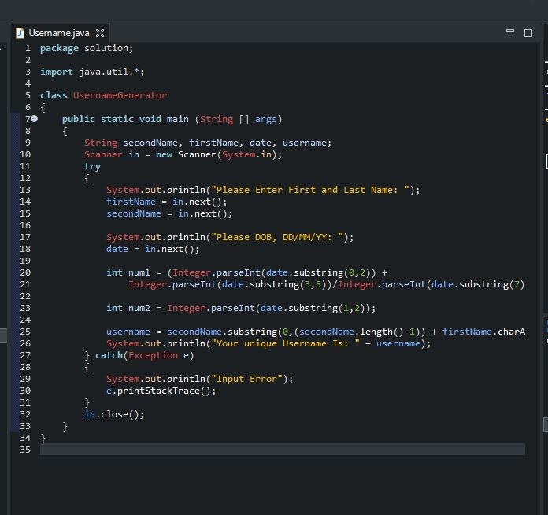
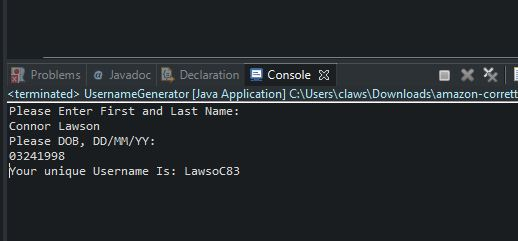

# Username Generator

This is documentation for code that generates a unique username for a user based off of thier name and date of birth.

## What You Need

Any java runtime application will work with this code, such as eclipse which can be downloaded [here](https://www.eclipse.org/downloads/packages/release/2020-09/r/eclipse-ide-eclipse-committers).

## Installation 

1. Navigate to the src/solution folder and click on the Username.java file, or click [here](https://github.com/lawsoncr/Project_2/blob/main/src/solution/Username.java).
2. Copy and paste the code into your java editing software.

    

3. Run the Code as a java application.
4. Enter your first and last name and your date of birth.

    
    
5. Hit enter on your keyboard and your username will be generated.
